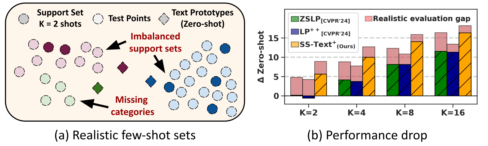

# Realistic Adaptation of Medical Vision-Language Models

 <br/>

The official implementation of [*Towards a Realistic Few-Shot Adaptation of Medical Vision-Language Models*]().<br/>
📜 <span style="color:red">*Medical Image Computing and Computer Assisted Intervention (MICCAI)*</span> \
[Julio Silva-Rodríguez<sup>1</sup>](https://scholar.google.es/citations?user=1UMYgHMAAAAJ&hl),
[Fereshteh Shakeri<sup>1,2</sup>](https://scholar.google.com/citations?user=aRRqD9oAAAAJ&hl),
[Houda Bahig<sup>2</sup>](https://scholar.google.com/citations?user=fsNWVFwAAAAJ&hl),
[Jose Dolz<sup>1,2</sup>](https://scholar.google.es/citations?user=yHQIFFMAAAAJ&hl),
[Ismail Ben Ayed<sup>1,2</sup>](https://scholar.google.es/citations?user=29vyUccAAAAJ&hl) <br/>
<sup>1</sup>ÉTS Montréal ⋅ <sup>2</sup> Centre Hospitalier de l’Université de Montréal (CRCHUM)<br/>
| [Conference]() | [ArXiv]() |
<br/>


### Install

* Install in your environment a compatible torch version with your GPU. For example:

```
conda create -n sstext python=3.11 -y
conda activate sstext
pip install torch==2.6.0 torchvision==0.21.0 torchaudio==2.6.0 --index-url https://download.pytorch.org/whl/cu124
```

```
git clone https://github.com/jusiro/SS-Text.git
cd SS-Text
pip install -r requirements.txt
```

### Preparing the datasets
- Configure data paths (see [`./local_data/constants.py`](./local_data/constants.py)).
- Download, and configure datasets (see [`./local_data/datasets/README.md`](./local_data/datasets/README.md)).

## Usage
We present the basic usage here.

(a) Features extraction:
- `python extract_features.py --task MESSIDOR`

(b) Standard adaptation:
- `python adapt.py --task MESSIDOR --k 4 --scenario standard --adapt SStext+`

(c) Relaxed adaptation scenario:
- `python adapt.py --task MESSIDOR --k 4 --scenario relaxed --adapt SStext+`

(d) Realistic adaptation scenario:
- `python adapt.py --task MESSIDOR --k 4 --scenario realistic --adapt SStext+`

You will find the results upon training at [`./local_data/results/`](./local_data/results/).

## Citation

If you find this repository useful, please consider citing the following sources.

- For the original SS-Text publication ([LINK](https://github.com/jusiro/FCA)), designed for fast conformal prediction:
```
@inproceedings{fca25,
    title={Full Conformal Adaptation of Medical Vision-Language Models},
    author={Julio Silva-Rodríguez and Leo Fillioux and Paul-Henry Cournède and Maria Vakalopoulou and
    Stergios Christodoulidis and Ismail {Ben Ayed} and Jose Dolz},
    booktitle={Information Processing in Medical Imaging (IPMI)},
    year={2025}
}
```

- For SS-Text+, designed for unbalanced scenarios, and realistic few-shot settings:
```
@inproceedings{sstext25,
    title={Towards a Realistic Few-Shot Adaptation of Medical Vision-Language Models},
    author={Julio Silva-Rodríguez and Fereshteh Shakeri and Houda Bahig and Jose Dolz and Ismail {Ben Ayed}},
    booktitle={Medical Image Computing and Computer Assisted Intervention (MICCAI)},
    year={2025}
}
```


